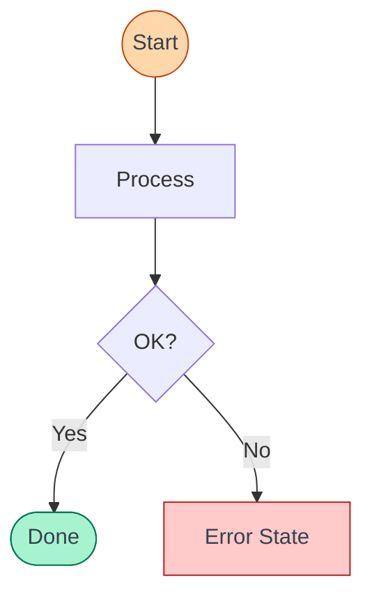

# Mermaid Diagram Creator

Generate `.mmd` files (or fenced ` ```mermaid ` blocks in `.md` files when embedding in docs). Reference `references/mermaid-theme.md` as the single style customization source.

## Customization

To customize brand styles, edit `references/mermaid-theme.md` and `references/mermaidConfig.json`. These are the single touchpoints. Do not hardcode colors in diagrams unless it is requested specifically and it should be preferred to source values from a per-project configuration if changes are requested.

---

## Core Philosophy

**Diagrams should ARGUE, not DISPLAY.**

A diagram isn't formatted text. It's a visual argument that shows relationships, causality, and flow that words alone can't express. The shape should BE the meaning.

**The Isomorphism Test**: If you removed all text, would the structure alone communicate the concept? If not, redesign.

**The Education Test**: Could someone learn something concrete from this diagram, or does it just label boxes? A good diagram teaches—it shows actual formats, real event names, concrete examples.

---

## Depth Assessment (Do This First)

Before designing, determine what level of detail this diagram needs:

### Simple/Conceptual Diagrams
Use abstract shapes when:
- Explaining a mental model or philosophy
- The audience doesn't need technical specifics
- The concept IS the abstraction (e.g., "separation of concerns")

### Comprehensive/Technical Diagrams
Use concrete examples when:
- Diagramming a real system, protocol, or architecture
- The diagram will be used to teach or explain (e.g., YouTube video)
- The audience needs to understand what things actually look like
- You're showing how multiple technologies integrate

**For technical diagrams, you MUST include evidence artifacts** (see below).

---

## Research Mandate (For Technical Diagrams)

**Before drawing anything technical, research the actual specifications.**

If you're diagramming a protocol, API, or framework:
1. Look up the actual JSON/data formats
2. Find the real event names, method names, or API endpoints
3. Understand how the pieces actually connect
4. Use real terminology, not generic placeholders

Bad: "Protocol" → "Frontend"
Good: "AG-UI streams events (RUN_STARTED, STATE_DELTA, A2UI_UPDATE)" → "CopilotKit renders via createA2UIMessageRenderer()"

**Research makes diagrams accurate AND educational.**

---

## Evidence Artifacts

Evidence artifacts are concrete examples that prove your diagram is accurate and help viewers learn. Include them in technical diagrams.

**Mechanics for Mermaid**:
- **Notes in sequence diagrams**: Use `Note over A,B: content` to show data payloads, API responses, or message formats.
- **Node labels with line breaks**: Use `<br/>` in node labels to show multi-line content. Example: `A["POST /api/v1/run<br/>body: {runId, input}"]`
- **Subgraph titles**: Use `subgraph "Section Name"` to add contextual labels to regions.
- **Companion .md files**: For code-heavy evidence like large JSON payloads or code snippets, create a companion `.md` file alongside the `.mmd` with fenced code blocks.
- **Acknowledge limitation**: Mermaid cannot embed arbitrary code blocks inside nodes. Keep node text concise and offload verbosity to companion files or Notes.

The key principle: **show what things actually look like**, not just what they're called.

---

## Multi-Zoom Architecture

Comprehensive diagrams operate at multiple zoom levels simultaneously. Think of it like a map that shows both the country borders AND the street names.

### Level 1: Summary Flow
A simplified overview showing the full pipeline or process at a glance. Often placed at the top or bottom of the diagram.

*Example*: `Input → Processing → Output` or `Client → Server → Database`

### Level 2: Section Boundaries
Labeled regions that group related components. These create visual "rooms" that help viewers understand what belongs together.

*Example*: Grouping by responsibility (Backend / Frontend), by phase (Setup / Execution / Cleanup), or by team (User / System / External)

### Level 3: Detail Inside Sections
Evidence artifacts, code snippets, and concrete examples within each section. This is where the educational value lives.

*Example*: Inside a "Backend" section, you might show the actual API response format, not just a box labeled "API Response"

**For comprehensive diagrams, aim to include all three levels.** The summary gives context, the sections organize, and the details teach.

### Bad vs Good

| Bad (Displaying) | Good (Arguing) |
|------------------|----------------|
| 5 equal boxes with labels | Each concept has a shape that mirrors its behavior |
| Card grid layout | Visual structure matches conceptual structure |
| Icons decorating text | Shapes that ARE the meaning |
| Same container for everything | Distinct visual vocabulary per concept |

### Simple vs Comprehensive (Know Which You Need)

| Simple Diagram | Comprehensive Diagram |
|----------------|----------------------|
| Generic labels: "Input" → "Process" → "Output" | Specific: shows what the input/output actually looks like |
| Named boxes: "API", "Database", "Client" | Named boxes + examples of actual requests/responses |
| "Events" or "Messages" label | Timeline with real event/message names from the spec |
| "UI" or "Dashboard" rectangle | Mockup showing actual UI elements and content |
| ~30 seconds to explain | ~2-3 minutes of teaching content |
| Viewer learns the structure | Viewer learns the structure AND the details |

**Simple diagrams** are fine for abstract concepts, quick overviews, or when the audience already knows the details. **Comprehensive diagrams** are needed for technical architectures, tutorials, educational content, or when you want the diagram itself to teach.

---

## Design Process

### Step 0: Assess Depth Required
Before anything else, determine if this needs to be:
- **Simple/Conceptual**: Abstract shapes, labels, relationships (mental models, philosophies)
- **Comprehensive/Technical**: Concrete examples, code snippets, real data (systems, architectures, tutorials)

**If comprehensive**: Do research first. Look up actual specs, formats, event names, APIs.

### Step 1: Understand Deeply
Read the content. For each concept, ask:
- What does this concept **DO**? (not what IS it)
- What relationships exist between concepts?
- What's the core transformation or flow?
- **What would someone need to SEE to understand this?** (not just read about)

### Step 2: Map Concepts to Patterns
For each concept, find the visual pattern that mirrors its behavior:

| If the concept... | Use this pattern |
|-------------------|------------------|
| Spawns multiple outputs | **Fan-out** (radial arrows from center) |
| Combines inputs into one | **Convergence** (funnel, arrows merging) |
| Has hierarchy/nesting | **Tree** (lines + free-floating text) |
| Is a sequence of steps | **Timeline** (line + dots + free-floating labels) |
| Loops or improves continuously | **Spiral/Cycle** (arrow returning to start) |
| Is an abstract state or context | **Cloud** (overlapping ellipses) |
| Transforms input to output | **Assembly line** (before → process → after) |
| Compares two things | **Side-by-side** (parallel with contrast) |
| Separates into phases | **Gap/Break** (visual separation between sections) |

### Step 3: Ensure Variety
For multi-concept diagrams: **each major concept must use a different visual pattern**. No uniform cards or grids.

### Step 4: Sketch the Flow
Before writing syntax, mentally trace how the eye moves through the diagram. There should be a clear visual story.

### Step 5: Generate Mermaid Syntax
1. Choose diagram type: consult `references/diagram-type-guide.md` decision matrix.
2. Load the per-type reference: open `references/types/<chosen-type>.md` for full syntax.
3. Write the syntax — start with a `%%` comment block naming the diagram type and describing each section.
4. Use meaningful node IDs (not `A`, `B`, `C` — use `authService`, `dbWrite`, `userInput`).
5. Add `classDef` for semantic styling (trigger, success, error, ai, decision) — pull from `references/mermaid-theme.md`.

### Step 6: Render & Validate
Run the render script and validate the output. See the **Render & Validate** section below.

---

## Visual Pattern Library

### Fan-Out (One-to-Many)
Central element with arrows radiating to multiple targets. Use for: sources, PRDs, root causes, central hubs.
```
        ○
       ↗
  □ → ○
       ↘
        ○
```
→ Use: Flowchart

### Convergence (Many-to-One)
Multiple inputs merging through arrows to single output. Use for: aggregation, funnels, synthesis.
```
  ○ ↘
  ○ → □
  ○ ↗
```
→ Use: Flowchart

### Tree (Hierarchy)
Parent-child branching with connecting lines and free-floating text. Use for: file systems, org charts, taxonomies.
```
  label
  ├── label
  │   ├── label
  │   └── label
  └── label
```
→ Use: Mindmap or Flowchart with subgraphs

### Spiral/Cycle (Continuous Loop)
Elements in sequence with arrow returning to start. Use for: feedback loops, iterative processes, evolution.
```
  □ → □
  ↑     ↓
  □ ← □
```
→ Use: State Diagram (self-transitions) or Flowchart with back-edge

### Cloud (Abstract State)
Overlapping ellipses with varied sizes. Use for: context, memory, conversations, mental states.
→ Use: C4 Diagram or Mindmap

### Assembly Line (Transformation)
Input → Process Box → Output with clear before/after. Use for: transformations, processing, conversion.
```
  ○○○ → [PROCESS] → □□□
  chaos              order
```
→ Use: Flowchart (TD) or Sequence Diagram

### Side-by-Side (Comparison)
Two parallel structures with visual contrast. Use for: before/after, options, trade-offs.
→ Use: Flowchart with parallel subgraphs

### Gap/Break (Separation)
Visual whitespace or barrier between sections. Use for: phase changes, context resets, boundaries.
→ Use: Flowchart subgraphs with visual spacing

### Lines as Structure (Timeline)
Use lines as primary structural elements.
```
Timeline:           Tree:
  ●─── Label 1        │
  │                   ├── item
  ●─── Label 2        │   ├── sub
  │                   │   └── sub
  ●─── Label 3        └── item
```
→ Use: Timeline Diagram or Sequence Diagram

---

## Node Shape Reference

| Syntax | Shape | Use For |
|--------|-------|---------|
| `[text]` | Rectangle | Process, action, component, step |
| `(text)` | Rounded rectangle | Softer process, intermediate step |
| `((text))` | Circle | Start/end point, event, trigger |
| `{text}` | Diamond (rhombus) | Decision, condition, branch |
| `([text])` | Stadium/pill | External system, service, API |
| `[[text]]` | Subroutine | Reusable component, function call |
| `>text]` | Asymmetric | Note, annotation, flag |
| `{{text}}` | Hexagon | Preparation step, configuration |
| `[/text/]` | Parallelogram | Input/Output |
| `[\text\]` | Alt parallelogram | Output (reversed slant) |
| `[/text\]` | Trapezoid | Manual operation |

---

## Semantic Styling with classDef

Key principle: use `classDef` for semantic meaning, not decoration.

Reference `references/mermaid-theme.md` for the full recipe table.

Example:


---

## Output Format

- **Default**: Create a `.mmd` file.
- **If embedding**: When the user says "embed", "add to docs", "in README", or the target is a `.md` file → output a fenced ` ```mermaid ` block instead.
- **When in doubt**: `.mmd` file.

---

## Large Diagram Strategy

Mermaid syntax is compact. Focus on readability:
- Use meaningful node IDs (`authService`, not `A`).
- Add `%%` comments for section breaks within the diagram.
- Keep nodes to ~20 max before splitting into multiple diagrams.
- For complex systems: one `.mmd` per layer (Context → Container → Component).
- Break dense subgraphs into separate files with cross-references in prose.

---

## Render & Validate (MANDATORY)

**How to render:**
```bash
bash .claude/skills/mermaid-diagram-skill/references/render_mermaid.sh <path.mmd> [output.png]
```
First run downloads mmdc via npx — may take ~30s.

**The loop:**
1. Write Mermaid syntax.
2. Run render script.
3a. If mmdc fails with a syntax error: read the error message, fix the syntax (usually: unquoted special chars, wrong keyword, missing `end`).
3b. If mmdc succeeds: view the PNG, assess the layout.
4. If layout is poor: restructure — reorder node/edge declarations to change placement, switch `rankDir` (TD ↔ LR), add or remove subgraphs.
5. Re-render → repeat until the layout communicates the concept cleanly.

**You cannot pixel-position elements** All layout improvements come from:
- **Reordering declarations** — the order nodes and edges appear in source directly influences Mermaid's placement algorithm.
- **Changing `rankDir`** — `TD`, `LR`, `BT`, `RL` — try the orthogonal direction when crossings persist.
- Consider whether hidden lines would be an appropriate fix for the issue.
- **Using subgraphs** — constrain placement of related nodes.
- NOT coordinate adjustments.

**Line crossing reduction**:
- Declare nodes in reading order (top→bottom, left→right).
- Minimize back-edges — isolate cycles in State diagrams or contained subgraphs.
- Declare related nodes together in source.
- Reduce fan-out: split any node with 5+ outgoing edges into a dispatcher → handlers.
- See `references/diagram-type-guide.md` Part 3 for the full layout optimization guide.

**When to stop**: syntax valid, layout communicates the concept, line crossings minimized, no overlapping labels, eye flows correctly through the diagram.

---

## Quality Checklist

**Concept & Depth (check first for technical diagrams):**
1. Research done: looked up actual specs, formats, event names?
2. Evidence artifacts: Notes, multi-line node labels, companion `.md` for large payloads?
3. Multi-zoom: summary flow + section subgraphs + detail labels?
4. Concrete over abstract: real API names, real event names, not generic "Process"?
5. Educational value: could someone learn from this diagram?

**Diagram Design:**
6. Isomorphism Test: does visual structure mirror the concept's behavior?
7. Argument: does the diagram SHOW something text alone couldn't?
8. Variety: does each major concept use a different visual pattern or node shape?
9. Diagram type chosen intentionally (matches the concept's pattern from decision matrix)?
10. Node IDs are readable, not single letters?

**Mermaid-Specific:**
11. `classDef` used for semantic styling (trigger, success, error, ai, decision)?
12. Output format correct (`.mmd` vs fenced block)?
13. No excluded diagram types used (no Pie, Gantt, Git Graph, XY Chart)?
14. Node/edge declaration order follows reading direction (minimize line crossings)?
15. No single node has 5+ edges without a dispatcher split?
16. Back-edges isolated (cycles handled in State diagram or contained subgraph)?

**Render Validation (mandatory):**
17. Syntax validated: mmdc runs without error?
18. PNG viewed: layout visually inspected?
19. No overlapping labels or crossed text?
20. Eye flows naturally through the diagram?
21. Line crossings minimized (tried reordering + rankDir if needed)?

**Cleanup**
Once a user is happy with the output, remove any temporary output like pngs or mmd files.