# Syntax Pitfalls — Common Mistakes to Avoid

Quick reference for avoiding the most frequent Mermaid render failures. Consult this alongside diagram type references.

---

## 1. Unquoted Special Characters (THE #1 FAILURE)

Any label containing parentheses, @, /, <, >, :, commas, or pipes must be wrapped in double quotes. The parser will fail if these characters are found naked in node definitions.

❌ Bad:
```mermaid
flowchart TD
    A[Send to user (optional)] --> B{Check auth@domain}
```

✅ Good:
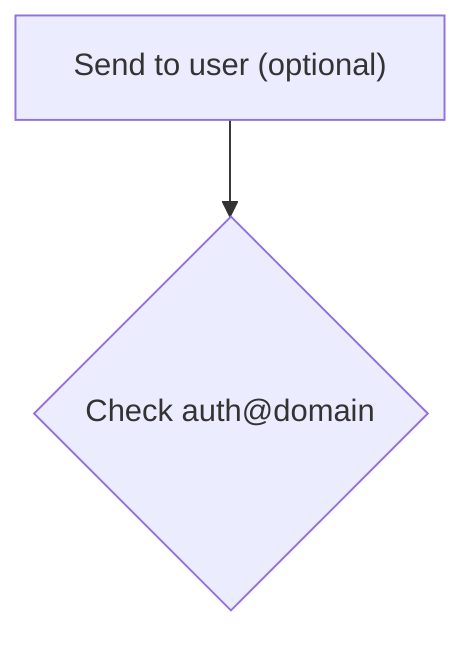

## 2. HTML Tags in Labels

Most HTML tags render inconsistently or crash the parser. Only `<br/>` is safe for line breaks, and even it should be wrapped in quotes for stability.

❌ Bad:
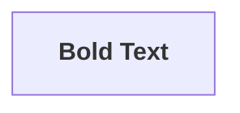

✅ Good:
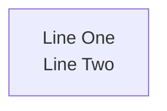

## 3. Long Labels Cause Overflow

Lengthy function signatures or descriptions in node labels cause overflow or truncation. Keep labels under 60 characters and move detail to notes.

❌ Bad:
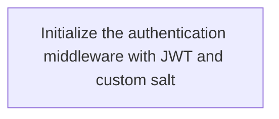

✅ Good:
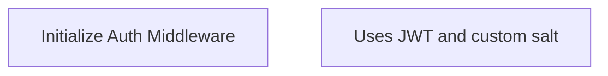

## 4. Stray Semicolons

Legacy Mermaid examples use semicolons after each line. While `graph` might tolerate them, they cause errors in modern diagram types. Omit them entirely.

❌ Bad:
```mermaid
sequence diagram;
    Alice->>Bob: Hello;
```

✅ Good:
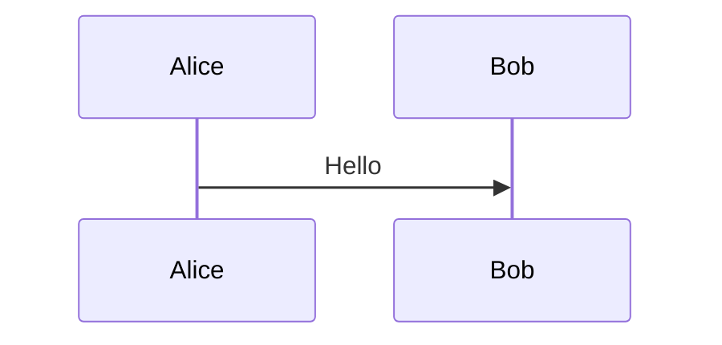

## 5. Mixing graph and flowchart

`graph` is legacy syntax while `flowchart` is modern, supporting subgraph direction and more shapes. Never mix them in the same block. Use `flowchart` by default.

❌ Bad:
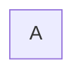

✅ Good:


## 6. Unescaped end as Label Text

`end` is a reserved keyword for closing blocks. A node whose entire label is `end` will be parsed as a block terminator, breaking the diagram.

❌ Bad:
```mermaid
flowchart TD
    A --> end
```

✅ Good:
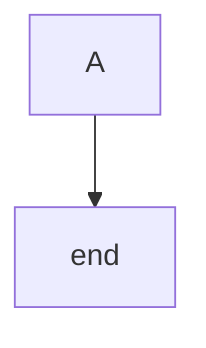

## 7. Overly Dense Diagrams

Diagrams with more than 20 nodes often produce unreadable spaghetti layouts. Split complex logic into multiple diagrams or use subgraphs to group related nodes.

## 8. Mixing Diagram Type Syntax

Each block must use exactly one grammar. Don't blend flowchart arrows with class diagram relationships or sequence diagram syntax.

❌ Bad:
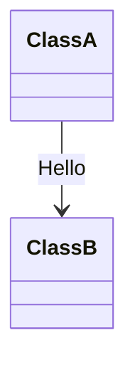

✅ Good:
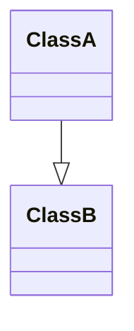

## 9. \n Instead of <br/>

The literal `\n` character does not create line breaks in Mermaid labels. Use `<br/>` inside double quotes instead.

❌ Bad:


✅ Good:


## 10. Missing end Keywords

Every subgraph, alt, loop, opt, par, critical, break, rect, and box block requires a corresponding `end`. Nested blocks are especially prone to missing terminators.

❌ Bad:
```mermaid
flowchart TD
    subgraph Outer
    subgraph Inner
    A
    end
```

✅ Good:
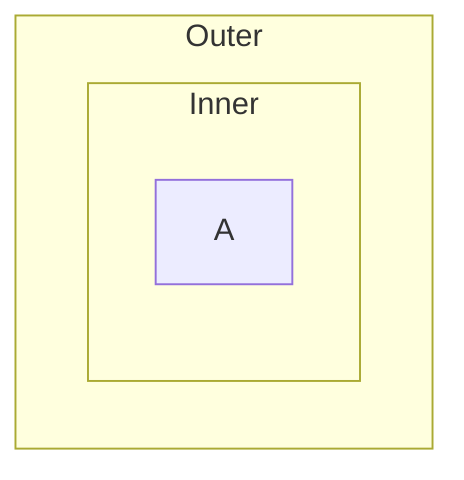

## Quick Rule

> **When in doubt, quote the label.** `["My label"]` is always safer than `[My label]`.
