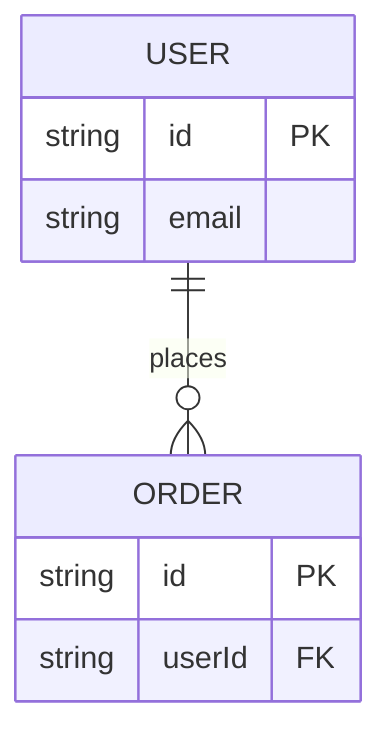
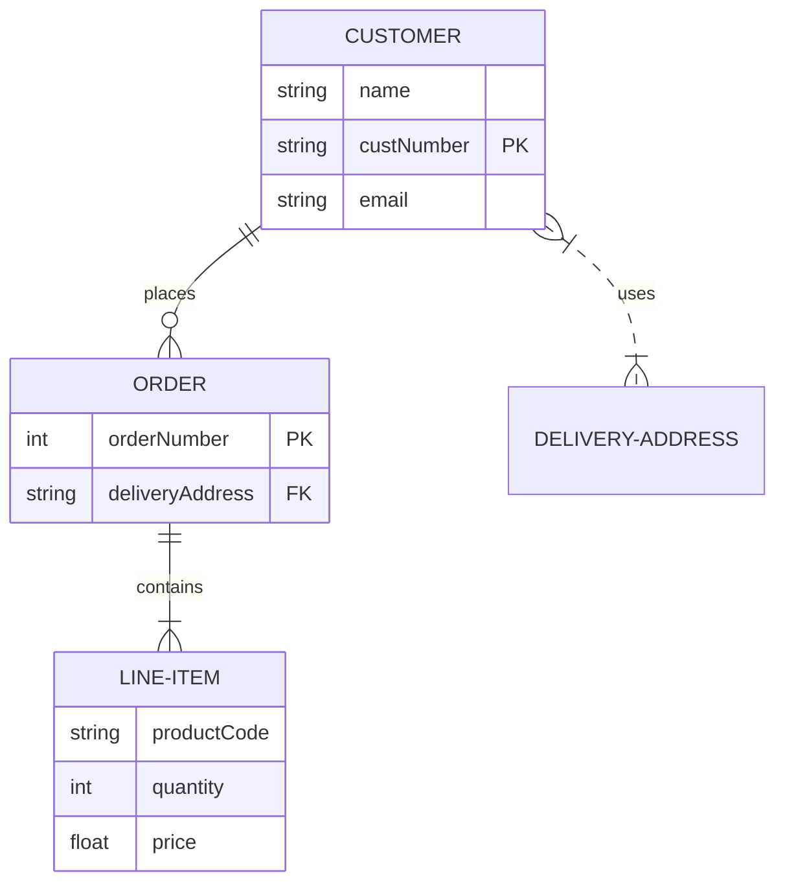

# ER Diagram

## When to Use
- Database schema design and entity relationship mapping.
- Primary/foreign key structures and cardinalities.
- Data modeling and structural documentation of data stores.

## Syntax Reference

### Basic Example

### Extended Example (with styling)

## All Supported Syntax

- **Keyword**: `erDiagram`.
- **Entity Block**: `ENTITY { type name [key] }`.
- **Data Types**: `string`, `int`, `float`, `boolean`, `date`, `datetime`.
- **Keys**: `PK` (Primary Key), `FK` (Foreign Key), `UK` (Unique Key).
- **Relationship Syntax**:
    - `||--||` One-to-one
    - `||--o{` One-to-many (zero or more)
    - `||--|{` One-to-many (one or more)
    - `}o--o{` Many-to-many (zero or more)
    - `}|..|{` Many-to-many (one or more)
- **Relationship Style**:
    - `--` Solid line (identifying relationship)
    - `..` Dotted line (non-identifying relationship)
- **Relationship Label**: `ENTITY1 }|--|{ ENTITY2 : "label"`.

## Layout Tips (type-specific)
- Declare the entity with the most relationships first to help the layout engine center it.
- Chain related entities outward from the center.
- Capitalize entity names by convention to improve readability.

## Common Pitfalls
- Cardinality syntax is very specific and can be hard to remember.
- Relation lines can cross frequently; order declarations to minimize this.
- Ensure all foreign keys correctly point to the intended primary keys.

## classDef Support
No.
