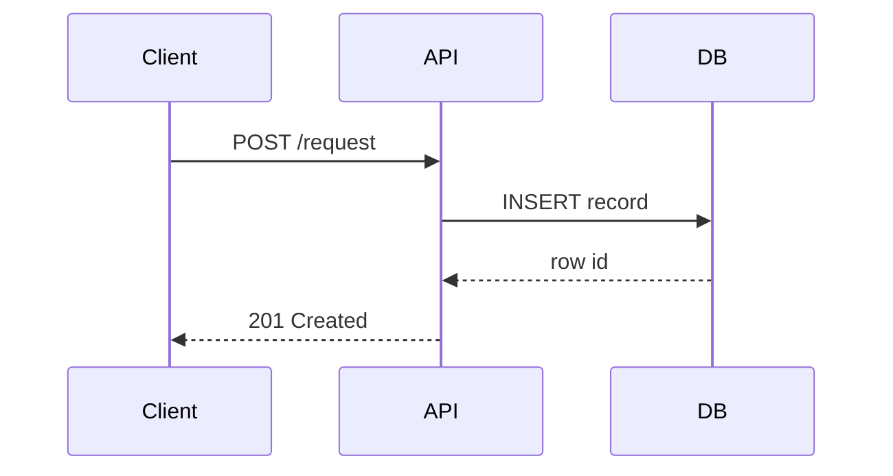
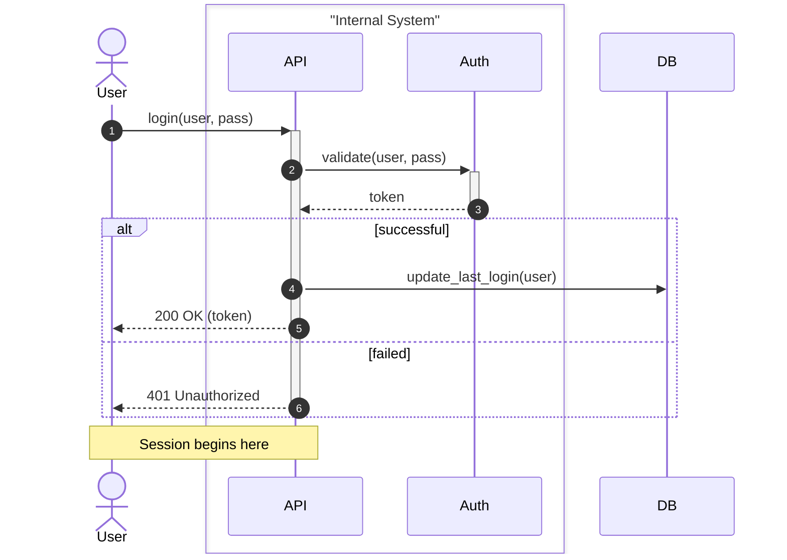

# Sequence Diagram

## When to Use
- Technical interaction flows between distinct components or services.
- API requests, authentication flows, and message passing between entities.
- Illustrating the chronological order of messages/interactions.
- Consider (potential) parallelism.

## Syntax Reference

### Basic Example

### Extended Example (with styling)

## All Supported Syntax

- **Keywords**: `sequenceDiagram`, `autonumber`.
- **Participants**: `participant Name`, `actor Name`. Use `as` for aliases: `participant A as API`.
- **Arrows**:
    - `->` Solid line (no arrow)
    - `-->` Dotted line (no arrow)
    - `->>` Solid line with arrowhead
    - `-->>` Dotted line with arrowhead
    - `-x` Solid line with crosshead
    - `--x` Dotted line with crosshead
    - `-)` Solid line with open arrow
    - `--)` Dotted line with open arrow
- **Activation**: `activate participant`, `deactivate participant` or use `+`/`-` suffix on arrow: `A->>+B: call`.
- **Notes**: `Note right of`, `Note left of`, `Note over`.
- **Blocks**:
    - `loop` ... `end`
    - `alt` ... `else` ... `end`
    - `opt` ... `end`
    - `par` ... `and` ... `end`
    - `critical` ... `option` ... `end`
    - `break` ... `end`
    - `rect color` ... `end` (background color)
- **Boxes**: `box "Label" color` ... `end`.

## Layout Tips (type-specific)
- Sequence diagrams are crossing-free by construction.
- Ordering participants from left (initiator) to right (final responder) is the primary layout lever.
- Use `autonumber` to make long traces easier to discuss in documentation.

## Common Pitfalls
- Participant order in the source determines column order.
- Avoid redefining participants mid-flow; declare all at the top.
- Complex loops and opt blocks can become unreadable if over-nested.

## classDef Support
No. Minimal styling via `Note`, `rect`, and `box`.
