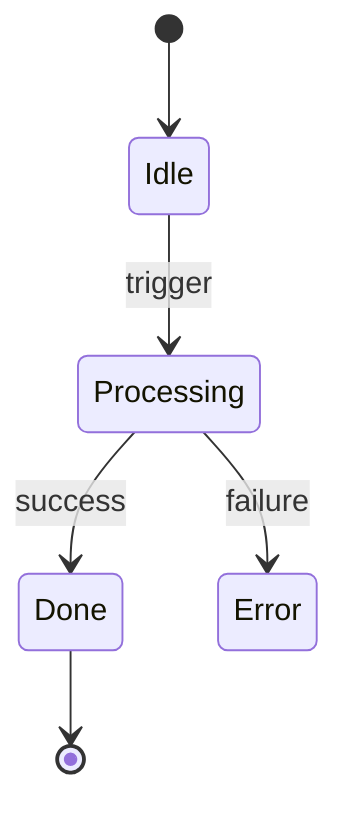
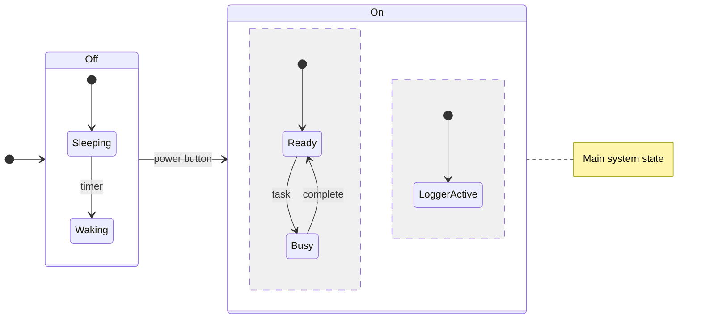

# State Diagram

## When to Use
- Object lifecycles and state machines.
- UI state management and finite state machines (FSM).
- Systems with discrete modes and specific triggers/transitions.

## Syntax Reference

### Basic Example

### Extended Example (with styling)

## All Supported Syntax

- **Keyword**: `stateDiagram-v2` is required for the modern renderer.
- **Start/End**: `[*]` represents the beginning and termination of the flow.
- **States**: `state "Label" as Name` or just `Name`.
- **Transitions**: `State1 --> State2 : transition label`.
- **Composite States**: `state Name { ... }` for nesting.
- **Concurrent States**: Use `--` divider within a state block.
- **Notes**: `note right of State`, `note left of State`.
- **Direction**: `direction TB` (top-down), `direction LR` (left-right).
- **Choices/Forks/Joins**:
    - `state Name <<choice>>`
    - `state Name <<fork>>`
    - `state Name <<join>>`

## Layout Tips (type-specific)
- Keep composite states self-contained to minimize complex routing.
- Use `direction LR` for state machines that read naturally left-to-right (e.g., a multi-stage pipeline).
- Use notes to provide context for complex transitions without cluttering the edge labels.

## Common Pitfalls
- Use `stateDiagram-v2` to avoid the legacy renderer.
- `[*]` is both the entry and exit point; ensure logical flow between them.
- Deep nesting of states can make the diagram difficult to read.

## classDef Support
Limited. Use `style StateName fill:#color` for basic node customization.
